# Banner 自動產生 — 業務 Quick Start

> 簡報源檔。每組 `---` 分一張 slide。
> 圖片：18 張已備在 `quick-start-images/`（除 07-底圖確認頁待補）
> 對應完整 PDF 版：`quick-start.md`

---
<!-- slide -->

## Banner 自動產生

### 業務 Quick Start

5 個步驟、~15 分鐘、不用設計師

---
<!-- slide -->

## 📑 目錄

| § | 章節 | 內容 |
|---|------|------|
| §1 | 開始前 | 系統認識、核心概念 |
| §2 | 開需求 → 啟動 | Step 1-3 + Chat 通知 |
| §3 | 各階段審核 | Step 4-7、字數、上傳救援 |
| §4 | 退回 / 重做 | 對照表、訣竅 |
| §5 | 全 AI 模式 | 最快路徑、信任 AI |
| §6 | FAQ + 聯絡 | 常見問題、找誰問 |

→ 翻簡報像翻字典，遇到問題跳到對應章節

---
<!-- slide -->

## 🔄 完整使用流程圖

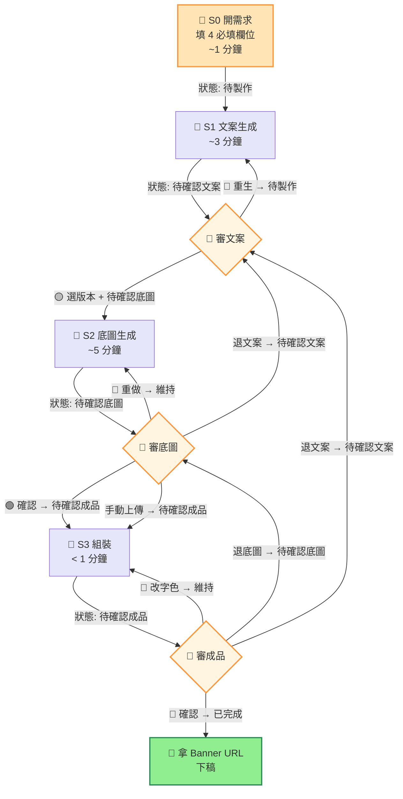

🟠 你做 / 🟣 系統做 / 🟢 完成

→ 詳細各階段 select / 狀態對照見 §3 - §4

---
<!-- slide -->

## 🔍 我有問題 → 跳到哪頁

| 問題 | 跳到 |
|------|------|
| 怎麼開始？ | §2 開需求 → 啟動 |
| 文案 / 圖不滿意？ | §3 各階段審核 |
| 字數限制是多少？ | §3 字數規則 |
| AI 生不出滿意的圖？ | §3 上傳救援 |
| 想退回 / 重做某一步？ | §4 退回 / 重做 |
| 急件、想最快拿到 banner？ | §5 全 AI 模式 |
| 系統卡住、找不到答案？ | §6 FAQ + 聯絡 |

---
<!-- slide -->

## §1 你會做什麼

| 你做 | 系統做 |
|------|--------|
| 開需求（填 4 欄）| 生文案、生底圖、組裝 |
| 確認 / 改寫文案 | — |
| 審底圖、審成品 | — |
| 拿成品下稿 | — |

**總時間 ~15-20 分鐘**（過去找設計師 4 小時起跳）

---
<!-- slide -->

## 開始前準備

| 項目 | 怎麼確認 |
|------|---------|
| Notion 工作區帳號 | 能打開 [Banner 製作管理 DB](https://www.notion.so/bef2ca44-6991-4de1-b5cf-5610043132db) |
| Google Chat 通知群 | 找 Kay 拉你進「Banner 自動化通知」 |
| Notion ID | 用來標「負責人」欄位 |

任一沒 OK → **找 Kay 開通**（5 分鐘）

---
<!-- slide -->

## 整體流程

```
你開需求
  ↓
系統生文案 → 你審文案
  ↓
系統生底圖 → 你審底圖
  ↓
系統組裝 → 你審成品
  ↓
拿 Banner URL → 下稿
```

每個「審」都可以 ✅ **確認** 或 🔄 **退回 / 重做**

---
<!-- slide -->

## ⚠️ 最重要的核心概念

### 兩個欄位控制系統

| 欄位 | 角色 |
|------|------|
| **「狀態」** | 司令官 — 告訴系統現在在哪、要去哪 |
| **「審核 select」**（🟡 / 🟢 / 🔵）| 指令 — 確認 / 重做的開關 |

### → 改完狀態系統才會動

光按 select 不改狀態 = 系統不會跑。

---
<!-- slide -->

## §2 Step 1 → 進 Notion DB

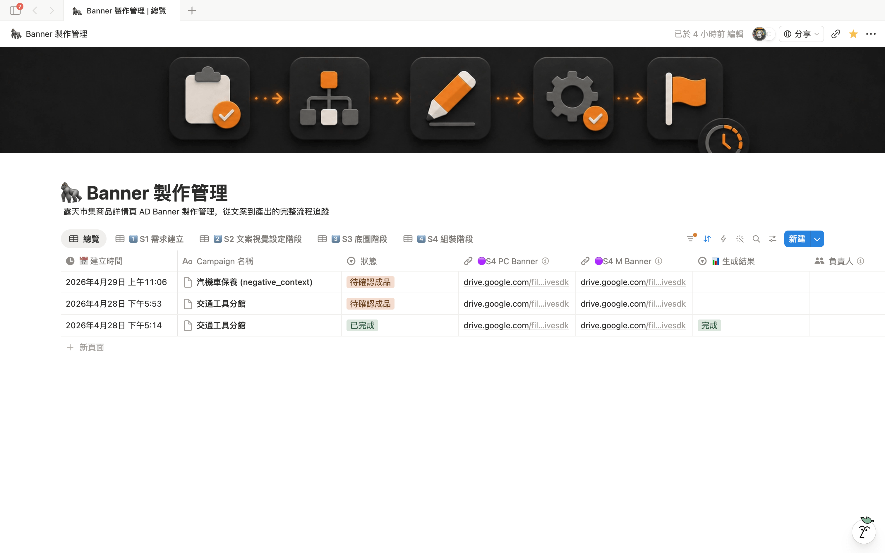

打開 [Banner 製作管理 DB](https://www.notion.so/bef2ca44-6991-4de1-b5cf-5610043132db) 看到列表

每筆 row = 一張 banner 需求。狀態欄位會自動更新進度。

---
<!-- slide -->

## Step 2 → 開新需求 — 4 個必填欄位

| 欄位 | 怎麼填 | 範例 |
|------|------|------|
| 🔘S1 活動 / 商品名稱 | 越具體越好 | 母親節保養品促銷 |
| 🔘S1 促銷重點 | 折扣 / 優惠 / 賣點 | 全館 85 折 + 滿千免運 |
| 🔘S1 目標受眾 | 給誰看 | 25-40 歲輕熟女 |
| 🔘S1 語氣風格 | 下拉選 | 溫馨 |

---
<!-- slide -->

## Step 2 → 選填欄位（可全空 → AI 自動）

| 欄位 | 用途 |
|------|------|
| 🔘S1 指定關鍵字 | 想強調的字（限時、獨家） |
| 🔘S2 視覺風格 | 想要的調性（奢華 / 童趣 / 北歐極簡） |
| 🔘S2 人物設定 | 要不要人物入鏡 |
| 🔘S2 渲染模式 / 材質 | 進階視覺控制 |

**全空也 OK** — AI 依品類自動配最適選項

---
<!-- slide -->

## Step 2 → 範例：填好的需求頁

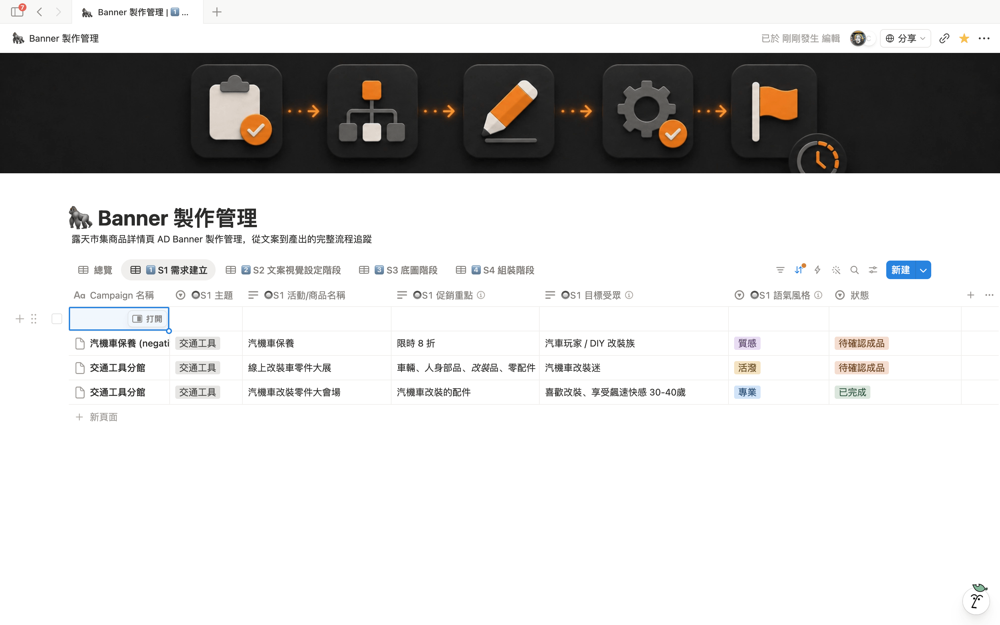

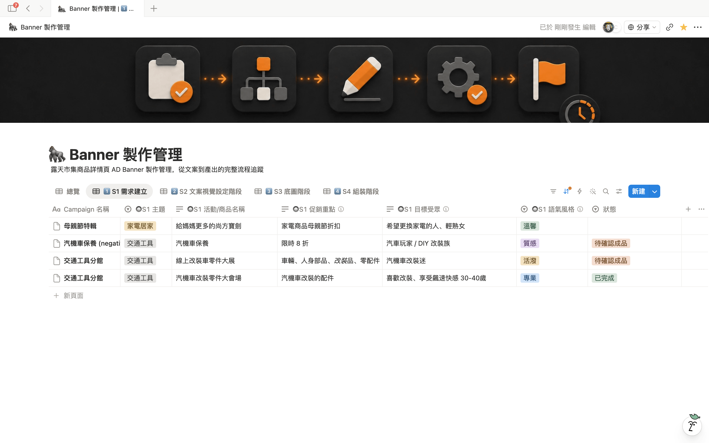
*母親節 / 85折 / 輕熟女 / 溫馨*

---
<!-- slide -->

## Step 3 → 啟動產線

下拉 **狀態** → 選 **「待製作」**

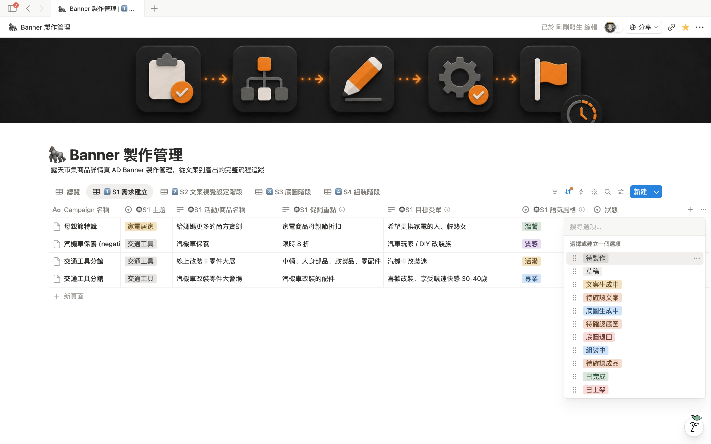

選完 → **系統 1 分鐘內自動接手**

---
<!-- slide -->

## Step 3 → 系統開始跑

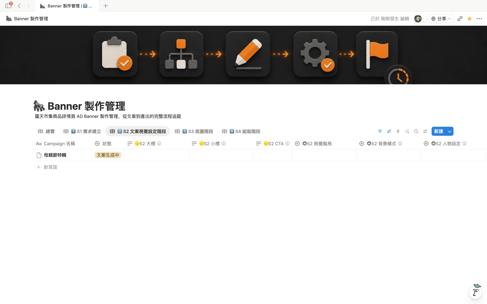

狀態自動跳成「文案生成中」

📋 Google Chat 推第一則通知 — **去喝杯咖啡 ~3 分鐘**

---
<!-- slide -->

## Chat 通知 — 4 則里程碑

| Emoji | 意義 | 通知畫面 |
|------|------|----------|
| 📋 | 接收需求 | 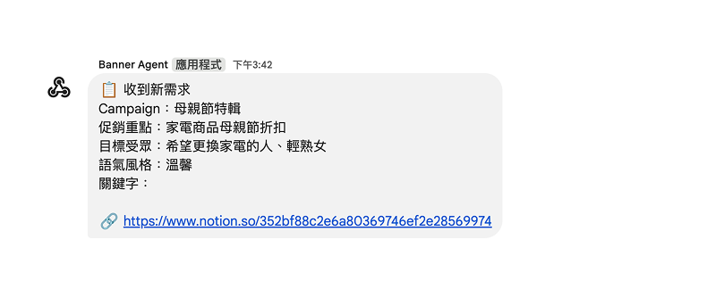 |
| 📝 | 文案完成 | 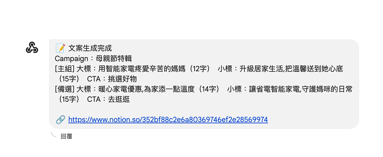 |
| 🖼️ | 底圖完成 | 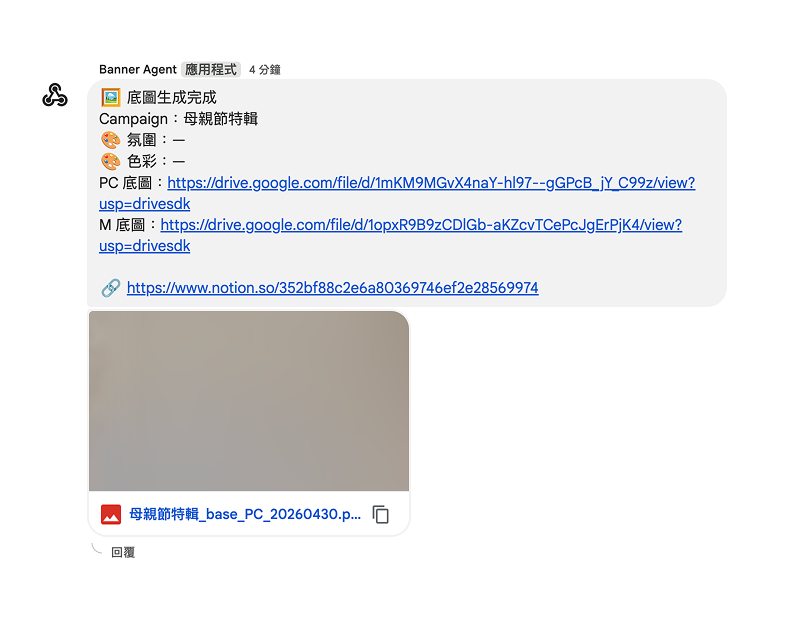 |
| ✅ | Banner 完成 | 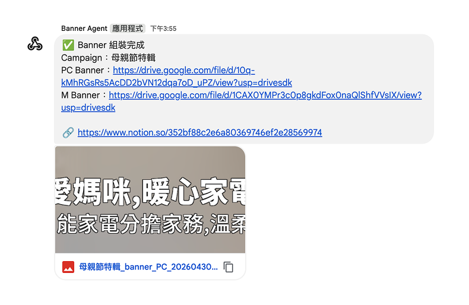 |

> 4 則通知總覽 → 詳見 PDF 版 §5

---
<!-- slide -->

## §3 Step 4 → 審文案

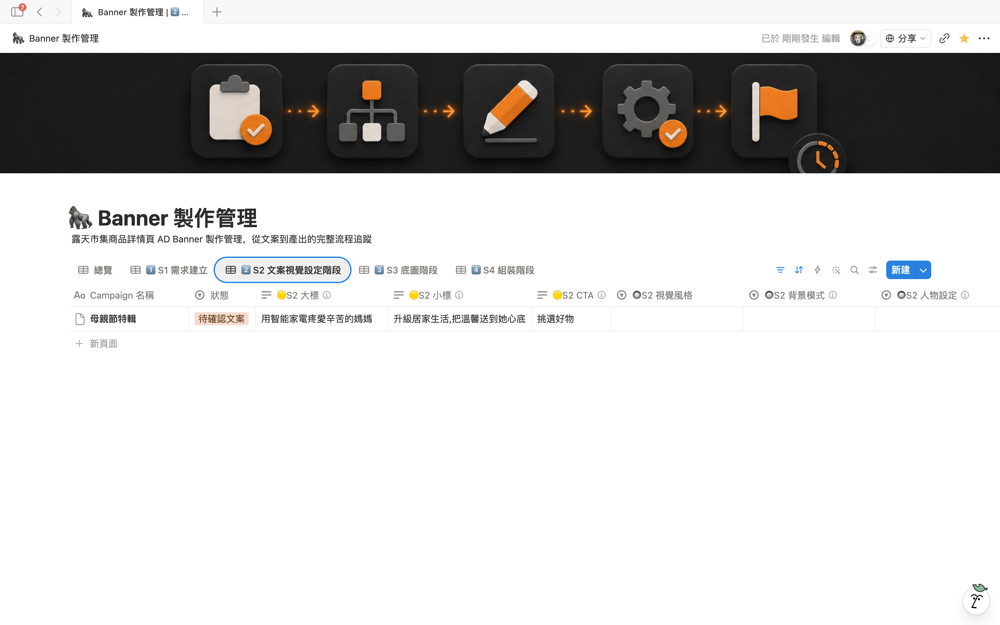

系統會給**兩組文案**（主組 + 備選）

每組 = 大標 / 小標 / CTA 三項

> 詳細選用 + 確認動作 → 詳見 PDF 版 §6（拆 3 張：form / s2 select / check）

---
<!-- slide -->

## Step 4 → 想做什麼 → 改 2 欄位

| 想做 | 改 1：選用 / 文案 | 改 2：狀態 |
|------|----------------|-----------|
| 用主組 | 🟡S2 選用版本 = **主組** | → **待確認底圖** |
| 用備選 | 🟡S2 選用版本 = **備選** | → **待確認底圖** |
| 自己改寫 | 直接改 大標 / 小標 / CTA | → **待確認底圖** |
| 兩組都爛、重生 | （不用改文案）| → **待製作**（重跑 S1）|

---
<!-- slide -->

## ✏️ 自己改寫文案 — 字數規則

| 元素 | 上限 |
|------|------|
| **大標 H1** | ≤ 12 字 |
| **小標 H2** | ≤ 15 字 |
| **CTA 按鈕** | ≤ 5 字 |

超過 → 系統自動縮字級，**仍超過會擠壓到變形**

---
<!-- slide -->

## ✏️ 字數範例對照

| 元素 | ✅ OK | ❌ 太長 |
|------|------|------|
| 大標 | 母親節 85 折禮遇（9）| 母親節限定全館保養品 85 折優惠（17）|
| 小標 | 滿千免運、頂級寵愛媽咪（11）| 三檔超殺優惠搶購季買滿千就免運再送好禮（19）|
| CTA | 立即搶購（4）| 馬上點我搶購活動商品（10）|

**訣竅**：寧可少一個字，不要貪多

---
<!-- slide -->

## Step 5 → 審底圖

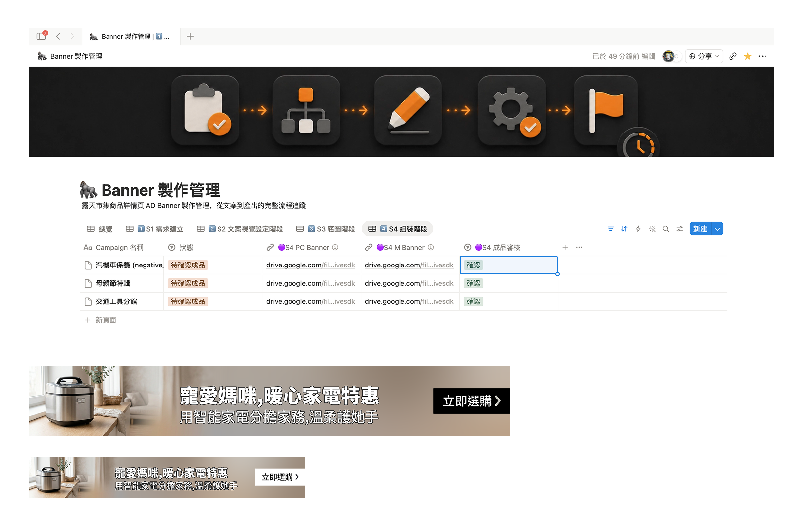

系統同時生 **PC 大圖**（2500×369）+ **手機版**（1436×212）

---
<!-- slide -->

## Step 5 → 想做什麼 → 改 2 欄位

| 想做 | 改 1：審核 select | 改 2：狀態 |
|------|----------------|-----------|
| 都 OK、進下一步 | 🟢 = **確認** | → **待確認成品** |
| 同條件重生 | 🟢 = **重做** | 維持 **待確認底圖** |
| 改文案再生 | （清空 🟢）| → **待確認文案** |
| 改用自己的圖 | 切「手動上傳」（下頁）| → **待確認成品** |
| 全部重來 | （不改）| → **待製作** |

---
<!-- slide -->

## 7.1 自己上傳底圖（救援）

連續重做 3-5 次仍生不出滿意 → 改用自己的圖

### 操作 5 步

1. PC 版底圖傳 **Google Drive** → 取分享連結
2. 同上傳 M 版
3. 🔵S3 底圖來源 = **「手動上傳」**
4. 🔵S3 底圖PC / M = **貼 Drive 連結**
5. 狀態 → **「待確認成品」**

---
<!-- slide -->

## 7.1 上傳規則（必守）

| 規則 | PC 版 | 手機版 |
|------|------|------|
| 尺寸 | **2500 × 369 px** | **1436 × 212 px** |
| 格式 | PNG | PNG |
| 主體位置 | 集中在左 30% | 集中在左 24% |
| 右側留白 | 50-70% 留白 / 漸層 | 56-76% 留白 / 漸層 |
| 大小 | **< 3 MB** | **< 3 MB** |

⚠️ **Drive 分享要選「任何人有連結可檢視」**，否則系統抓不到

---
<!-- slide -->

## 7.1 為何要左側集中 + 右側留白

系統會把**文字（大標 / 小標 / CTA）疊在右側**

主體跑到中央或右邊 → 文字疊在主體上 → **看不清楚**

---
<!-- slide -->

## 7.1 設計師交圖時請告訴他

- Banner 底圖，PC 2500×369 / M 1436×212
- PNG，每張 < 3 MB
- 主體放**左 30%**，右側留白給文字
- **不用做文字 / CTA 按鈕**，系統會自動疊
- 丟我 Drive，**權限開「任何人有連結可檢視」**

---
<!-- slide -->

## Step 6 → 審成品

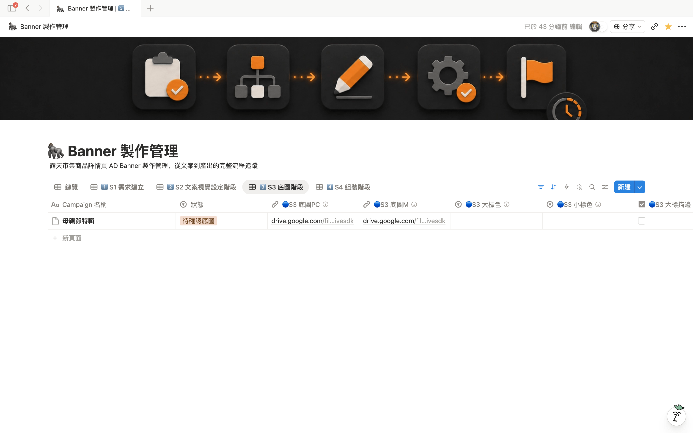

系統把文字（大標 / 小標 / CTA 按鈕）疊到底圖上

自動處理對比、字體、置中

> PC / M 局部圖 → 詳見 PDF 版 §8（拆 3 張：總覽 / -pc / -m）

---
<!-- slide -->

## Step 6 → 想做什麼 → 改 2 欄位

| 想做 | 改 1：select / 顏色 | 改 2：狀態 |
|------|--------------------|-----------|
| 完美、下稿 | 🔵S3 成品審核 = **確認** | → **已完成** |
| 改字色 / 描邊 | 改顏色 + 🔵 = **重做** | 維持 **待確認成品** |
| 換底圖 | （清 🔵）| → **待確認底圖** |
| 改文案 | （清 🔵）| → **待確認文案** |
| 全重來 | （不改）| → **待製作** |

---
<!-- slide -->

## Step 7 → 完成、拿 Banner URL

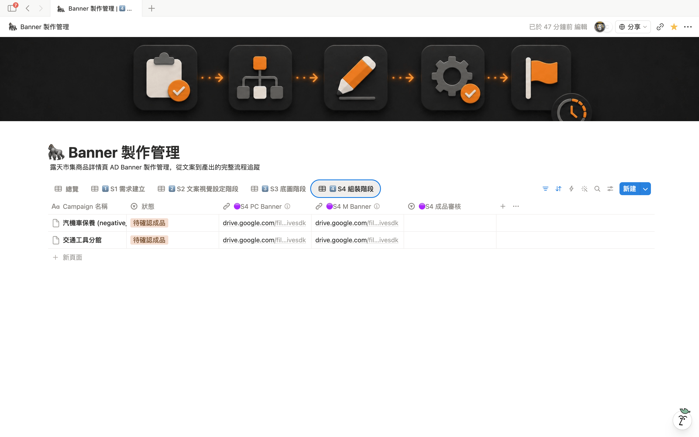

| 欄位 | 用途 |
|------|------|
| 🟣S3 PC Banner | 拿這個下 desktop 稿 |
| 🟣S3 M Banner | 拿這個下手機稿 |

> check / PC URL / M URL 局部 → 詳見 PDF 版 §9（拆 4 張）

⚠️ **下稿前必做**：圖丟 [TinyPNG](https://tinify.cn/) 壓縮（< 500 KB 才能上稿）

---
<!-- slide -->

## 🎉 整張 banner ~15-20 分鐘搞定

從填需求到拿成品 — 不用設計師、不用排隊

---
<!-- slide -->

## §4 退回 / 重做 — 核心邏輯

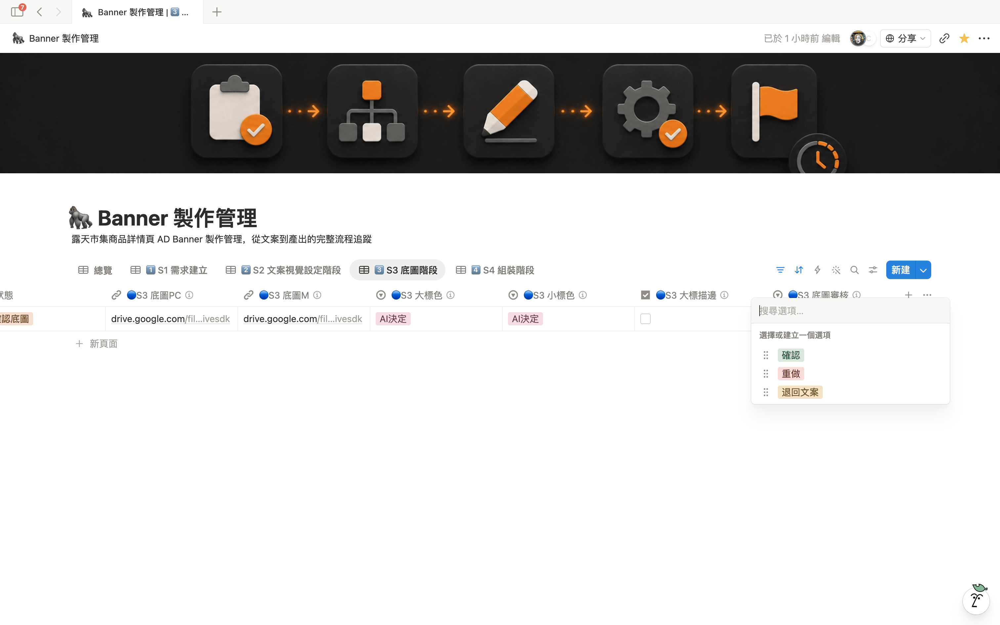
*S3 階段（待確認底圖）的狀態下拉 + 🟢S2 審核 select*

每階段都能退，但要**自己改「狀態」欄位**告訴系統

> S4 階段對照 → 詳見 PDF 版 §10（10b 圖）

光按 select、光改文案 → 系統不會動

---
<!-- slide -->

## 在「待確認文案」階段 — 5 種選擇

| 想做 | 狀態改成 → | 順便動的 select |
|------|-----------|---------------|
| OK 進下一步 | 待確認底圖 | 🟡 選版本 |
| 重生新文案 | 待製作 | （不用） |
| 直接改寫文字 | 待確認底圖 | （改後狀態前進）|

---
<!-- slide -->

## 在「待確認底圖」階段 — 5 種選擇

| 想做 | 狀態改成 → | 順便動的 select |
|------|-----------|---------------|
| OK 進下一步 | 待確認成品 | 🟢 = 確認 |
| 重生底圖（最常用）| 維持 | 🟢 = 重做 |
| 退回改文案 | 待確認文案 | 清空 🟢 |
| 改用自己的圖 | 待確認成品 | 切手動上傳 |
| 全重來 | 待製作 | 清空 🟢 |

---
<!-- slide -->

## 在「待確認成品」階段 — 5 種選擇

| 想做 | 狀態改成 → | 順便動的 select |
|------|-----------|---------------|
| OK 完成 | 已完成 | 🔵 = 確認 |
| 改字色 / 描邊 | 維持 | 改顏色 + 🔵 = 重做 |
| 換底圖 | 待確認底圖 | 清 🔵 |
| 改文案 | 待確認文案 | 清 🔵 |
| 全重來 | 待製作 | 清 🔵 |

---
<!-- slide -->

## 4 種重做差別 — 時間對照

| 動作 | 重生什麼 | 多久 | 何時用 |
|------|--------|------|------|
| **重做成品** | 文字疊圖 | < 1 分鐘 | 改字色 / 描邊 |
| **重做底圖** | 底圖 + 成品 | ~3 分鐘 | 文字 OK 但圖不行 |
| **退回文案** | 文案 + 底圖 + 成品 | ~7 分鐘 | 文字本身要改 |
| **退回待製作** | 全部 | ~10 分鐘 | 整張要重來 |

---
<!-- slide -->

## 退回訣竅

- **先確定文案再進底圖**（最費時的是底圖、不要重複生）
- **顏色 / 描邊**用「重做成品」，不要退到底圖
- 不滿意第一張底圖先試「重做底圖」**2-3 次**，仍不行再退文案
- 永遠**先動 select 再動狀態**

---
<!-- slide -->

## §5 進階：全 AI 模式（最快路徑）

時間趕、不挑剔、信任 AI default → 走全 AI 模式

### S0 開需求

| 欄位 | 怎麼填 |
|------|------|
| 4 個必填 | 正常填（一定要） |
| 視覺風格 / 人物 / 渲染等選填 | **全空著**（AI 自動決定）|

---
<!-- slide -->

## 進階：全 AI 模式 — 各階段審核

| 階段 | 直接設定 |
|------|---------|
| 待確認文案 | 🟡 = 主組 + 狀態前進（不細看）|
| 待確認底圖 | 🟢 = 確認 + 狀態前進（不重做）|
| 待確認成品 | 🔵 = 確認 + 狀態前進（不調字色）|

---
<!-- slide -->

## 全 AI 模式 — 預期 vs 何時選

| 模式 | 時間 | 滿意度 |
|------|------|------|
| 標準流程 | 15-20 分 | 高 |
| **全 AI 模式** | **10-12 分** | 中 |

✅ 內部 demo / 急件 / 同質性活動
❌ 重點檔期 / 第一次上某品類

---
<!-- slide -->

## §6 常見問題（1/2）

| Q | A |
|---|---|
| 5 分鐘了狀態沒變？ | 系統 1 分鐘輪詢、最多等 2 分鐘。仍卡 → 找 Kay |
| 字太長會怎樣？ | 系統自動縮字級。建議大標 ≤ 12 / 小標 ≤ 15 / CTA ≤ 5 |
| 商品圖被裁掉？ | 點「重做底圖」3 次仍不行 → 找 Kay 看 prompt |

---
<!-- slide -->

## 常見問題（2/2）

| Q | A |
|---|---|
| 字色看不清楚？ | 手動指定 🔵S3 大標色 + 描邊 → 重做成品 |
| 一次開很多筆？ | 可以、系統排隊。建議單批 ≤ 5 筆 |
| 急件怎麼辦？ | 標題加「[急]」+ Chat 私訊 Kay |

---
<!-- slide -->

## 找誰問

| 情境 | 找誰 |
|------|------|
| 帳號 / 群組開通 | Kay（Notion 私訊）|
| 系統卡住 / 報錯 | Kay（截圖 + 貼 row 連結） |
| 文案 / 風格不滿意 | 試「重做」3 次，仍不行找 Kay |
| 想加新風格 / 版型 | Kay 排期評估 |

---
<!-- slide -->

## 開始試試！

打開 [Banner 製作管理 DB](https://www.notion.so/bef2ca44-6991-4de1-b5cf-5610043132db)

第一張 banner ~15 分鐘

有問題隨時 Notion 私訊 Kay

---

> 簡報源 v0.1 — 2026-04-30
> 對應完整 PDF：`quick-start.md`
