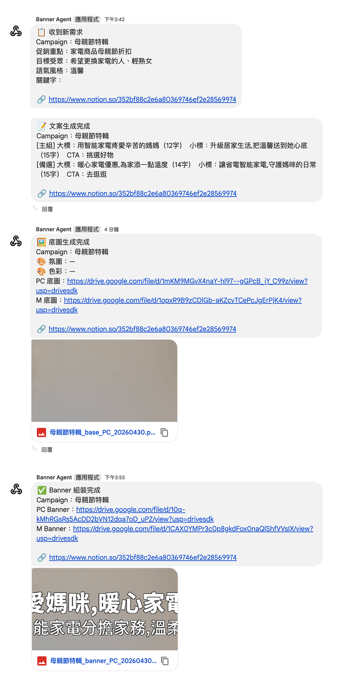
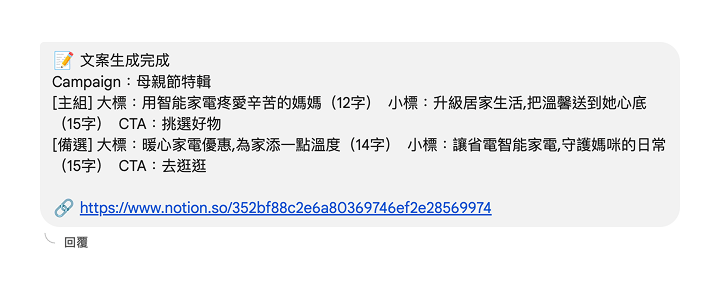
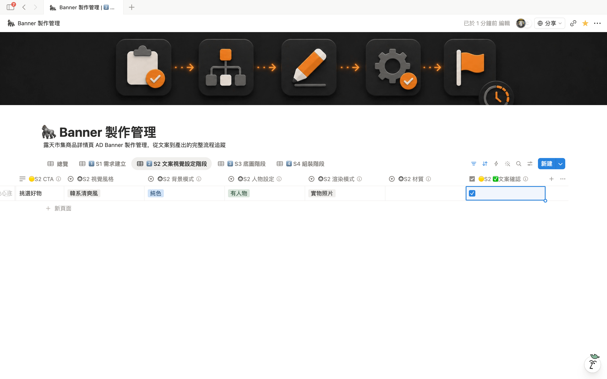
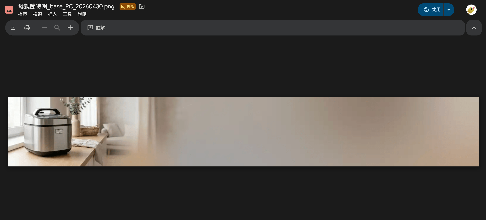
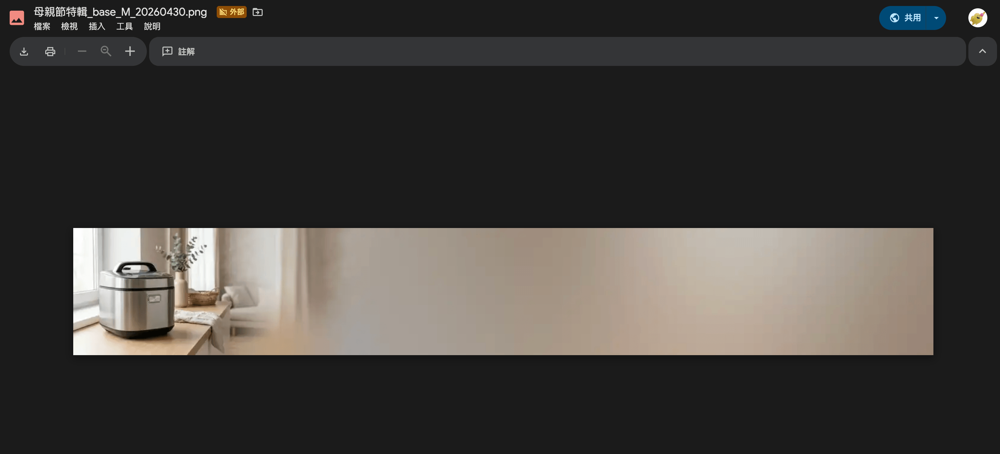
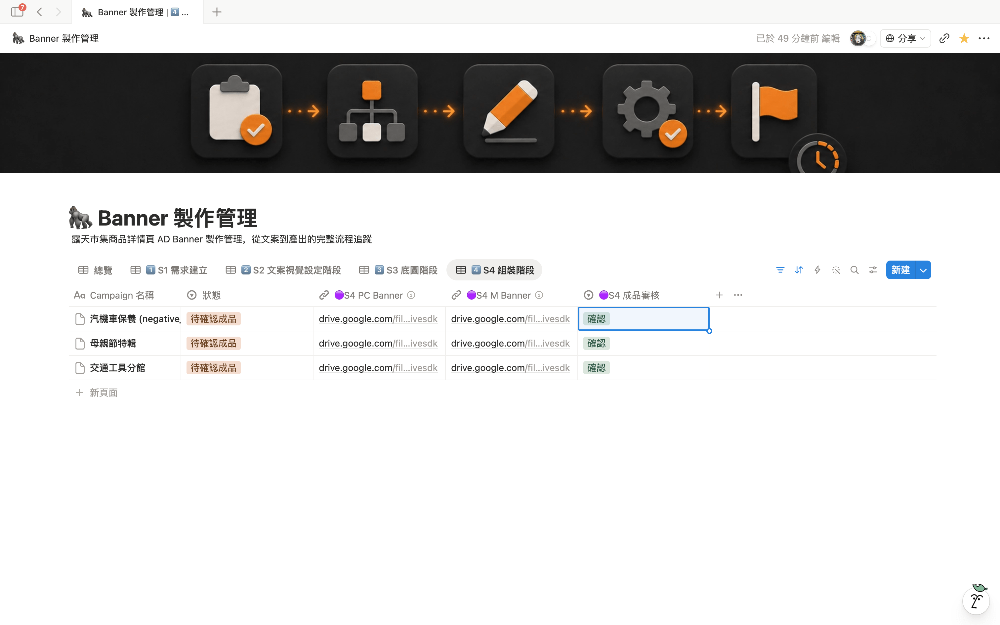
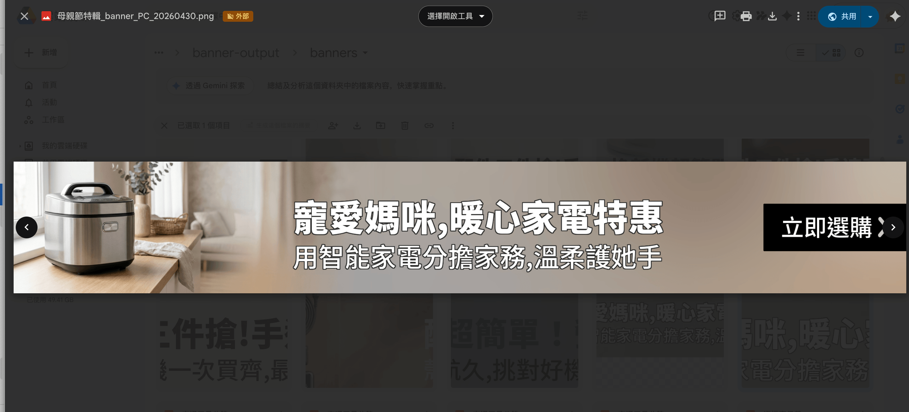
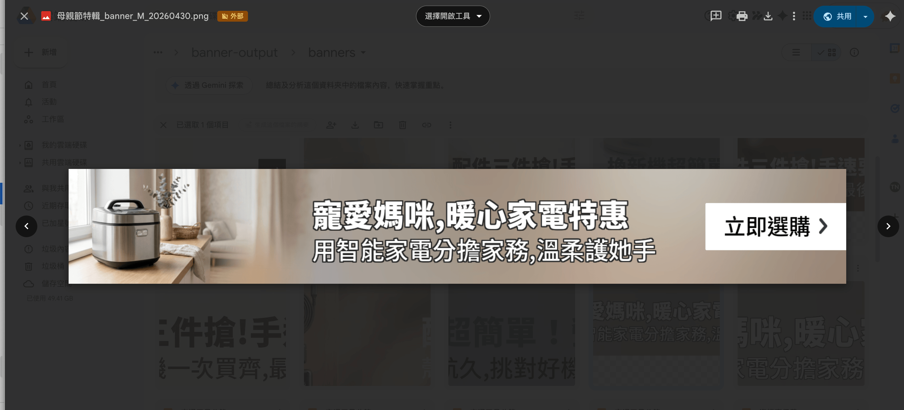
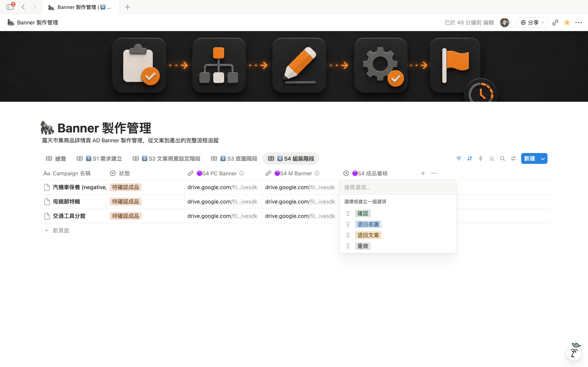

# Banner 自動產生 — 業務 Quick Start

> 5 個步驟搞定一張 banner，全程不需要設計師排隊。
> 第一次用 → 跟著本教學跑一輪，~10 分鐘上手。

---

## 0. 你會做什麼

| 你做 | 系統做 |
|------|--------|
| 在 Notion 開一筆需求（填活動名稱、促銷重點等 4 欄）| 自動生文案、自動生底圖、自動組裝 banner |
| 確認 / 改寫文案 | — |
| 審底圖、審成品（不滿意可重做）| — |
| 拿到成品 URL → 下稿 | — |

整體時間：**填需求 1 分鐘 + 等系統 ~10 分鐘 + 你審 3 次共 ~5 分鐘 = 共 ~15-20 分鐘**

對比過去找設計師排隊（4 小時起跳） — **省 90%+ 時間**。

---

## 1. 開始前準備

| 項目 | 怎麼確認 |
|------|---------|
| 已加入 Notion 工作區 | 點開[Banner 製作管理 DB 連結](https://www.notion.so/bef2ca44-6991-4de1-b5cf-5610043132db)，能看到列表就 OK |
| 已加入 Google Chat 通知群 | 找 Kay 拉你進「Banner 自動化通知」群（系統會在每個階段推 Chat 給你）|
| 知道你的 Notion ID | 用來標「負責人」欄位（讓系統知道通知誰）|

如果以上任一項沒 OK → 找 Kay 開通（5 分鐘）。

---

## 2. 整體流程

```
你開需求 → 系統生文案 → 你審文案 → 系統生底圖 → 你審底圖
                                                      ↓
                                              系統組成品 → 你審成品 → 拿 Banner URL
```

每個 **「你審」** 步驟都可以：
- ✅ **確認** → 進下一步
- 🔄 **退回 / 重做** → 改文案或重生底圖（不會從頭來）

---

## 3. Step 1 → 進 Notion DB

打開 [Banner 製作管理 DB](https://www.notion.so/bef2ca44-6991-4de1-b5cf-5610043132db) ，看到列表畫面：


*🖼️ Notion 列表 view，多筆 Campaign 列表 + 狀態欄位*

每一筆 row = 一張 banner 需求。狀態欄位（最右邊）會自動更新進度，你可以隨時開回來看。

---

## 4. Step 2 → 開新需求 + 填 4 個必填欄位

點左上 **+ New** 開一筆新 row，看到空白頁。


*🖼️ 新增 row 後 4 個必填欄位的空白狀態*

填以下 4 個必填欄位（其他選填）：

| 欄位 | 怎麼填 | 範例 |
|------|-------|------|
| 🔘S1 活動 / 商品名稱 | 你要推的東西，越具體越好 | 母親節保養品促銷 |
| 🔘S1 促銷重點 | 折扣 / 優惠 / 活動賣點 | 全館 85 折 + 滿千免運 |
| 🔘S1 目標受眾 | 給誰看的 | 25-40 歲輕熟女、上班族 |
| 🔘S1 語氣風格 | 從下拉選一個 | 溫馨 |

**選填欄位**（有需要才填）：
- 🔘S1 指定關鍵字 — 想強調的字（例：限時、獨家）
- 🔘S2 視覺風格 — 想要的調性（例：奢華、童趣、北歐極簡）
- 🔘S2 人物設定 — 要不要人物入鏡（預設 AI 自動）

填好後畫面像這樣：


*🖼️ 4 個必填欄位填好範例（母親節 / 85 折 / 輕熟女 / 溫馨）*

---

## 5. Step 3 → 啟動產線（選「待製作」）

下拉 **狀態** 欄位，選 **「待製作」**：


*🖼️ 狀態欄位下拉打開，看到「待製作」選項*

選完 → 系統 1 分鐘內會自動接手。

**狀態會自動跳成「文案生成中」**：


*🖼️ 狀態自動跳成「文案生成中」*

這時候 Google Chat 群會收到第一則通知：


*🖼️ 11a Chat 通知總覽 — 4 則通知一次看*


*🖼️ 11b 第 1 則 📋 接收需求 — 系統開始接手*


*🖼️ 11c 第 2 則 📝 文案完成 — 該你審文案*


*🖼️ 11d 第 3 則 🖼️ 底圖完成 — 該你審底圖*


*🖼️ 11e 第 4 則 ✅ Banner 完成 — 該你審成品*

📋 收到需求 — 系統開始跑了，去喝杯咖啡 ~3 分鐘後回來。

---

## 6. Step 4 → 審文案、確認 / 改寫

文案跑完狀態變 **「待確認文案」**，Chat 推 📝 文案完成。

開回該筆 row，畫面看到：


*🖼️ 06a 主組 + 備選文案兩組並列（大標 / 小標 / CTA）*


*🖼️ 06b 🟡S2 選用版本 select 下拉位置*


*🖼️ 06c 選用 + 改狀態進下一步*

系統會給你**兩組文案**（主組 + 備選）。

### ⚠️ 關鍵概念 — 兩個欄位控制系統

| 欄位 | 作用 |
|------|------|
| **「狀態」**（下拉） | 司令官 — 告訴系統現在在哪、要去哪 |
| **「審核 select」**（🟡 / 🟢 / 🔵 開頭） | 指令 — 確認 / 重做的開關 |

→ **每次你要系統繼續跑，都要動「狀態」這個欄位**，光改文案 / 審核 select 系統不會動。

### 你想做什麼 → 改哪 2 個欄位

| 你想做 | 改 1：選用 / 文案 | 改 2：狀態 → |
|------|-----------------|--------------|
| 主組 OK 用主組 | 🟡S2 選用版本 = **主組** | **「待確認底圖」** |
| 想用備選 | 🟡S2 選用版本 = **備選** | **「待確認底圖」** |
| 自己改寫文案 | 直接改 大標 / 小標 / CTA（見下方字數規則）| **「待確認底圖」** |
| 兩組都爛、重生新文案 | （不用改文案） | **「待製作」**（系統重跑 S1）|

✅ **記住**：確認進下一步 = 狀態改成「待確認底圖」。光按 select 不改狀態 = 系統不會動。

### ✏️ 自己改寫文案 — 字數規則（必守）

| 元素 | 硬規定 | 超過會怎樣 |
|------|------|-----------|
| **大標**（H1） | **≤ 12 字** | 系統自動縮字級到下限（PC -12px / M -8px），仍超過 → 文字溢出版面 |
| **小標**（H2） | **≤ 15 字** | 同上自動縮（PC -8px / M -8px） |
| **CTA 按鈕** | **≤ 5 字** | 自動縮字 60% 寬度，極限約 38px |

**範例**：

| 元素 | ✅ OK | ❌ 太長 |
|------|------|------|
| 大標 | 母親節 85 折禮遇（9 字） | 母親節限定全館保養品 85 折優惠（17 字 → 字會被擠壓）|
| 小標 | 滿千免運、頂級寵愛媽咪（11 字） | 三檔超殺優惠搶購季買滿千就免運費再送好禮（19 字）|
| CTA | 立即搶購（4 字） | 馬上點我搶購活動商品（10 字 → 縮到看不清）|

**訣竅**：字數越精煉視覺越好。寧可少一個字，不要貪多。

---

## 7. Step 5 → 審底圖（PC + Mobile 兩版）

底圖跑完狀態變 **「待確認底圖」**，Chat 推 🖼️ 底圖完成。


*🖼️ PC 底圖 + M 底圖 + 🟢S2 底圖審核 select 同框*

系統同時生 **PC 大圖**（2500×369）+ **手機版**（1436×212）兩張。

### 你想做什麼 → 改哪 2 個欄位

| 你想做 | 改 1：審核 select | 改 2：狀態 → |
|------|-----------------|--------------|
| 兩張都 OK、進下一步 | 🟢S2 底圖審核 = **確認** | **「待確認成品」** |
| 同條件重生新底圖 | 🟢S2 底圖審核 = **重做** | **「待確認底圖」** 不變 |
| 改文案再重生 | （清空 🟢S2 底圖審核） | **「待確認文案」** |
| **改用自己的圖**（重生不出滿意的） | 切「手動上傳」+ 貼圖（見 §7.1） | **「待確認成品」** |
| 全部重來 | （不用改 select） | **「待製作」** |

✅ **記住**：
- 「重做」= 同文案、同 prompt，系統幫你抽一張新的（最常用）
- 「退回文案」= 想換文字內容才用，會把底圖也清掉重生
- **改完狀態系統才會動**，光改 select 不改狀態 = 系統不會跑

---

## 7.1 自己上傳底圖（AI 生不出滿意時的救援）

連續重做 3-5 次仍生不出滿意的圖 → 改用自己的底圖（從 Figma / 設計師 / 自己拍）。

### 操作步驟（共 5 步）

| # | 動作 | 欄位 / 工具 |
|---|------|-----------|
| 1 | 把 PC 版底圖傳到 Google Drive | Drive 工作資料夾 → 上傳 → 取「分享連結」（任何人有連結可檢視）|
| 2 | 同上把 M 版底圖傳 Drive | 取分享連結 |
| 3 | 切換「底圖來源」 | 🔵S3 底圖來源 = **「手動上傳」**（原本是「AI 生成」）|
| 4 | 貼 PC + M Drive 連結 | 🔵S3 底圖PC = **PC 版 Drive 連結** / 🔵S3 底圖M = **M 版 Drive 連結** |
| 5 | 進下一步 | 狀態 → **「待確認成品」**（系統跳過 AI 生圖直接組裝）|

> ⚠️ **連結權限要打開**：Drive 分享一定要選「**任何人有連結可檢視**」，不然系統抓不到圖會報錯。

### ⚠️ 上傳規則（必守，否則組裝會壞）

| 規則 | PC 版 | 手機版 |
|------|------|------|
| 尺寸（嚴格） | **2500 × 369 px** | **1436 × 212 px** |
| 格式 | PNG | PNG |
| 主體位置 | **集中在左 30%** | **集中在左 24%** |
| 右側留白 | 右 50-70% 必須留白 / 漸層 / 純色 | 右 56-76% 必須留白 / 漸層 / 純色 |
| 檔案大小 | **< 3 MB** | **< 3 MB** |

> ⚠️ **為何要左側集中 + 右側留白**：系統會把文字（大標 / 小標 / CTA 按鈕）疊在右側。如果主體跑到中央或右邊，文字會疊在主體上看不清楚。

### 設計師交圖時請告訴他

- 「Banner 底圖，PC 2500×369 / M 1436×212，PNG，每張 < 3 MB」
- 「主體放左 30%，右側留白給文字」
- 「不用做文字 / CTA 按鈕，系統會自動疊」
- 「丟我 Google Drive，分享權限開『任何人有連結可檢視』」

---

## 8. Step 6 → 審成品（最終 banner）

成品跑完狀態變 **「待確認成品」**，Chat 推 ✅ Banner 完成。


*🖼️ 08a 成品確認頁總覽（PC + M + 🔵S3 成品審核 select）*


*🖼️ 08b PC 版 Banner 局部*


*🖼️ 08c 手機版 Banner 局部*

系統把文字（大標 / 小標 / CTA 按鈕）疊到底圖上，自動處理對比、字體、置中。

### 你想做什麼 → 改哪 2 個欄位

| 你想做 | 改 1：審核 select / 顏色 | 改 2：狀態 → |
|------|----------------------|--------------|
| 完美、下稿 | 🔵S3 成品審核 = **確認** | **「已完成」** |
| 改字色 / 描邊重組 | 改 🔵S3 大標色 / 小標色 / 描邊 + 🔵S3 成品審核 = **重做** | **「待確認成品」** 不變 |
| 換底圖 | （清 🔵S3 成品審核）| **「待確認底圖」** |
| 改文案 | （清 🔵S3 成品審核）| **「待確認文案」** |
| 全部重來 | （不用改 select） | **「待製作」** |

✅ **記住**：
- 「重做成品」= 同底圖、改字色 / 描邊重組（不重生底圖，秒成）
- 退到底圖 = 想換圖（保留文案，重生底圖）
- 退到文案 = 想換文字（清掉底圖、文案重審）

---

## 9. Step 7 → 完成、拿 Banner URL

確認後狀態變 **「已完成」**，Chat 推 🎉 完成通知。


*🖼️ 09a 狀態「已完成」+ 🟣S3 PC Banner / M Banner 兩個 URL 欄位*


*🖼️ 09b 確認完成的動作位置*


*🖼️ 09c 🟣S3 PC Banner URL 欄位細節*


*🖼️ 09d 🟣S3 M Banner URL 欄位細節*

兩個成品 URL 在這兩個欄位：
- 🟣S3 PC Banner — 拿這個下 desktop 版稿
- 🟣S3 M Banner — 拿這個下手機版稿

**下稿前必做**：把圖丟進 [TinyPNG](https://tinify.cn/) 壓縮（< 500 KB 才能上稿）。

🎉 完成！整張下來大約 15-20 分鐘。

---

## 10. 退回 / 重做完整對照（最重要的一頁）

### 核心邏輯

每個階段都可以退回前面，但你必須**自己改「狀態」欄位**告訴系統「我要退到 X」。光按 select、光改文案，系統不會動。


*🖼️ 10a 在「待確認底圖」階段的狀態下拉 + 🟢S2 審核 select*


*🖼️ 10b 在「待確認成品」階段的狀態下拉 + 🔵S3 審核 select*

### 退 / 重做完整對照表

> 找你目前在的「現在階段」橫列，看你要做什麼，照「改成這個狀態」改。

| 現在在 | 想做 | 「狀態」改成 → | 順便要改的 select |
|------|------|---------------|----------------|
| 待確認文案 | 兩組文案都爛、重生 | 「待製作」 | （不用）|
| 待確認文案 | OK、進下一步 | 「待確認底圖」 | 🟡S2 選用版本 = 主組 / 備選 |
| 待確認底圖 | 同條件重生底圖（最常用）| 「待確認底圖」維持 | 🟢S2 底圖審核 = **重做** |
| 待確認底圖 | 退回改文案 | 「待確認文案」 | （清空 🟢S2 底圖審核）|
| 待確認底圖 | OK、進下一步 | 「待確認成品」 | 🟢S2 底圖審核 = **確認** |
| 待確認底圖 | 整張全重來 | 「待製作」 | （清空 🟢S2 底圖審核）|
| 待確認成品 | 改字色 / 描邊、原底圖重組（秒成）| 「待確認成品」維持 | 改顏色欄 + 🔵S3 成品審核 = **重做** |
| 待確認成品 | 換底圖、文案不變 | 「待確認底圖」 | （清空 🔵S3 成品審核）|
| 待確認成品 | 換文案 | 「待確認文案」 | （清空 🔵S3 成品審核）|
| 待確認成品 | OK、完成 | 「已完成」 | 🔵S3 成品審核 = **確認** |
| 待確認成品 | 全重來 | 「待製作」 | （清空 🔵S3 成品審核）|

### 4 種重做差別（最容易搞混）

| 動作 | 重生什麼 | 保留什麼 | 多久 | 何時用 |
|------|--------|---------|------|------|
| 重做成品 | 文字疊圖 | 底圖 + 文案 | < 1 分鐘 | 只想改字色 / 描邊 |
| 重做底圖 | 底圖 + 成品 | 文案 | ~3 分鐘 | 文字 OK 但圖不行 |
| 退回文案 | 文案 + 底圖 + 成品 | S0 需求 | ~7 分鐘 | 文字本身要改 |
| 退回待製作 | 全部 | （無） | ~10 分鐘 | 整張要重來 |

### 訣竅

- **先確定文案再進底圖**（最費時的是底圖、不要重複生）
- **顏色 / 描邊**用「重做成品」，不要退到底圖（浪費 ~6 分鐘）
- **不滿意第一張底圖**先試「重做底圖」2-3 次，仍不行再退文案
- **永遠先動 select 再動狀態**，狀態是最後的開關

---

## 11. 進階：全 AI 模式（信任 AI、最快路徑）

時間趕、不挑剔、想最快拿到 banner？走「全 AI 模式」 — 各階段選填欄位全空、審核全 ✅ 直接過。

### 設定方式

**S0 開需求時**：

| 欄位 | 怎麼填 |
|------|------|
| 4 個必填欄位（活動名稱 / 促銷重點 / 受眾 / 語氣）| **正常填**（這 4 欄一定要）|
| 🔘S2 視覺風格 | **空著**（AI 依品類自動配風格）|
| 🔘S2 人物設定 | **空著**（AI 依品類決定要不要人物）|
| 🔘S2 渲染模式 / 材質 / 背景模式等選填 | **全空著**（AI 自動決定）|

**各階段審核時**：

| 階段 | 直接設定 |
|------|---------|
| 待確認文案 | 🟡S2 選用版本 = 主組 + 狀態 → 待確認底圖（不細看內容）|
| 待確認底圖 | 🟢S2 底圖審核 = 確認 + 狀態 → 待確認成品（不重做）|
| 待確認成品 | 🔵S3 成品審核 = 確認 + 狀態 → 已完成（不調字色）|

### 預期時間 vs 結果

| 模式 | 時間 | 滿意度 |
|------|------|------|
| 標準流程（每階段審） | 15-20 分鐘 | 高（每步都微調） |
| **全 AI 模式** | **10-12 分鐘** | 中（信任 AI default） |

### 何時選全 AI 模式

- ✅ 內部使用、demo、測試版
- ✅ 急件、上稿時間很趕
- ✅ 同質性活動（系列檔期、月月促銷）
- ❌ 重點檔期（雙 11、母親節主推） — 建議標準流程細審
- ❌ 第一次上某個品類 — 先細審看 AI 表現

### 中途想切回標準流程

任何階段不滿意都可以走 §10 退回 / 重做，不會被「全 AI 模式」綁死。

---

## 12. 常見問題

| Q | A |
|---|---|
| 我選了「待製作」但 5 分鐘了狀態沒變 | 系統每 1 分鐘輪詢，最多等 2 分鐘。仍卡住 → 找 Kay 看 log。 |
| 文案的字怎麼算？太長會怎樣？ | 系統會自動縮字級塞下，但建議大標 ≤ 12 字、小標 ≤ 15 字、CTA ≤ 5 字。 |
| 商品圖被裁掉 / 被遮 | 點「重做底圖」重生一張；連續 3 張都不行 → 找 Kay 看 prompt。 |
| 字色看不清楚 | 手動指定 🔵S3 大標色 + 描邊 → 點「重做成品」。 |
| 我可以一次開很多筆嗎？ | 可以，系統會排隊處理。建議單批 ≤ 5 筆，避免擠到別人。 |
| 急件怎麼辦？ | 在標題加「[急]」並 Chat 私訊 Kay，她會優先處理。 |

---

## 13. 找誰問

| 情境 | 找誰 |
|------|------|
| 帳號 / 群組開通 | Kay（Notion 私訊）|
| 系統卡住 / 報錯 | Kay（先截圖 + 貼 row 連結）|
| 文案 / 視覺風格不滿意 | 先試「重做」3 次，仍不行再找 Kay 調 prompt |
| 想加新風格 / 新版型 | Kay 排期評估 |

---

> 教學版本 v0.1 — 2026-04-30
> 有問題或建議 → Notion 私訊 Kay 補上
